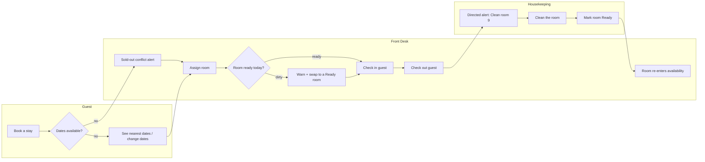

# Epic

## Overview

The checkout→clean→ready loop and the realtime + WhatsApp notification backbone already
work end-to-end in `hotelpms` (verified: checkout sets the room Dirty+Vacant and auto-creates a
"Checkout Clean" Housekeeping Task; the task going Done sets the room Clean→Ready; laundry,
lost & found, guest tickets and the HK phone app all exist). This epic does **not** re-plan any of
that. It closes the four *operational gaps* the owner hit around that working loop, so that a room's
cleanliness state actually protects the guest experience at the moment it matters:

1. **A room that is dirty *right now* must not be silently handed to a guest at assignment or
   check-in** — Front Desk should be warned and offered a Ready room to swap to. (Today `available_rooms`
   only excludes Occupied / Out of Order, and `handle_check_in` only errors when the room is *missing*;
   the `turnover.room_is_ready()` helper exists but has zero callers.)
2. **A guest whose requested dates are sold out currently gets nothing** but a desk-side thrown error —
   they should be notified and given a "see nearest available dates / change your dates" path, plus a
   Front Desk conflict alert. (This is the owner's *"حتى يستطيع تغيير التاريخ"*.)
3. **The auto-created Checkout Clean task is Unassigned** (pull/claim queue); the housekeeper is only
   messaged later on SLA breach. It should optionally be dispatched to an on-shift housekeeper with a
   proactive bilingual *"نظّف الغرفة ٩ / Clean room 9"* alert through the **existing** channels.
4. **The shipped behavior is undocumented.** The thin `contracts/*` files are behind the code; this epic
   backfills the data-model + API contracts so future stories plan from an accurate map.

The domain rule the guards must respect: a room dirty *today* is irrelevant to a booking *next month*
(it will be cleaned many times before then), so cleanliness is **never** excluded from future
availability — the guard fires only for **imminent/same-day assignment and at check-in**. "No inventory
for the dates" (a booking-time problem) and "the assigned room is dirty right now" (a check-in-time
problem) are handled by two different stories.

_(Cross-lane handoffs: guest sold-out conflict → Front Desk alert; guest change-dates → Front Desk
re-assign; Front Desk checkout → Housekeeping directed clean; Housekeeping room-ready → Front Desk
re-sell. The `f6→h1` and `h3→f7` handoffs already exist — story 003 only adds the **directed dispatch**
on top of the existing task creation.)_

## Stories
| id | title | role | depends_on |
|----|-------|------|------------|
| 001 | Same-day cleanliness guard at assignment & check-in (+ "Ready" status fix) | front_desk | — |
| 002 | Sold-out booking conflict → notify guest & offer change-dates | guest | — |
| 003 | Directed housekeeper dispatch on checkout | housekeeping | — |
| 004 | Backfill the data-model & API contracts (repay contract debt) | front_desk | 001, 002, 003 |

## Notes

**Open decisions (proposed defaults — owner may change; chatting a change re-invokes the planner):**
- **A1 — hard block vs. warn+override?** Proposed default: **warn + offer a Ready-room swap**, and allow
  Front Desk to override and check in anyway with an explicit confirmation (a supervisor may knowingly
  seat a guest in a room being cleaned). Not a silent hard `throw`.
- **A1 — guest self-check-in (`PublicCheckin.tsx`).** Self-check-in does not assign a room, but if the
  already-assigned room is dirty at self-check-in the flow should **degrade to "please see the front
  desk"** rather than block or seat silently.
- **B1 — how is "on-shift housekeeper" determined?** No dedicated roster/shift-roster exists (there is a
  `Shift Handover` doctype, but it is handover notes, not an availability roster). Proposed default:
  a **property-level "auto-dispatch" toggle** + pick among users holding the `Housekeeping` role for the
  property (round-robin / least-loaded); when auto-dispatch is off, keep today's Unassigned claim queue.
  Do **not** invent a new rostering system in this epic.
- **A2 — when does the guest get a WhatsApp vs. an on-page message?** Proposed default: the on-page
  "nearest dates / change dates" panel always renders for the on-page guest; a WhatsApp goes out **only
  when a phone/booking context exists** (desk-initiated booking or a waitlisted stay), reusing
  `agents_channels.send_outbound`. Reuse the existing `create_booking(waitlist=1)` park path.

**Shared-file overlaps (additive, non-blocking — flagged so parallel stories don't fear a collision):**
- `apps/hotelpms/hotelpms/api.py` — the monolithic whitelisted-API surface; stories append **new**
  functions (§2b's greenfield per-domain split does not apply to this brownfield app — project.md says
  extend the existing app). To minimize contention, new endpoints land in their domain module where one
  exists (`turnover.py`, `public_api.py`, the doctype controllers) and only touch `api.py` where the
  edited function already lives there.
- `apps/hotelpms/hotelpms/hotelpms/doctype/reservation/reservation.py` — story 001 edits
  `handle_check_in`, story 003 edits `handle_check_out`; **different methods**, no logical conflict.
- `apps/hotelpms/frontend/src/lib/api.ts` — every story appends typed client wrappers; additive.

**Out of scope (do NOT create stories for these):**
- Checkout automation, cleaning-done→ready, laundry, lost & found, guest tickets/room-needs, room
  statuses, and the realtime/WhatsApp backbone — **all already shipped and verified**; this epic reuses
  them, it does not rebuild them.
- **D1 — device push / a notification center (FUTURE enhancement, not this epic):** no FCM / native push /
  Expo, and no in-app Notification Log / notification-center UI. All alerts in this epic ride the existing
  `publish_realtime("hotelpms_changed")` + `agents_channels.send_outbound` (WhatsApp) channels only.
- Contract files are updated **only on owner approval** of the five proposals under
  `.bildfast/contracts/changes/` — no story edits `api-spec.md` / `data-models.md` before that.
